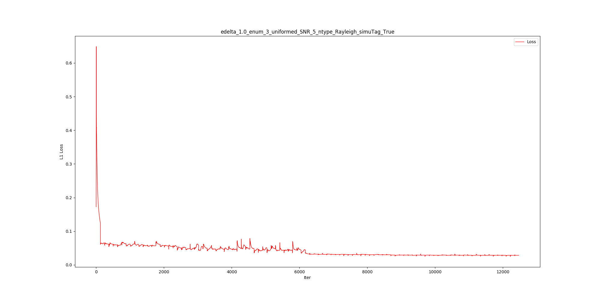
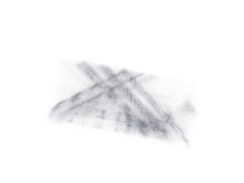

# Update: 20200825

### Description:

According to last result on 20200823, the improvement result is much logical. Distribution of pred/gt seems much better than that of image/gt.  
However, we much care about the 'important' points that play significant role in visualization result.  
So, I pick out the top important point of gt to get the static result of these selected points.

### The following static operations have been done in this report:  
1.Pick out top 0~0.001, 0.001~0.01, 0.01~0.05, 0.05~0.1 points of gt, and get corresponding points of prediction .  
2.Static different groups of points on step 1 and draw bar charts.

## Result:

### GT different top group visualization:

<table border="1" cellspacing="0" cellpadding="0">

<tbody>

<tr>

<td>top group</td>

<td>0~0.001</td>

<td>0.001~0.01</td>

<td>0.01~0.05</td>

<td>0.05~0.1</td>

</tr>

<tr>

<td>MazdaMPV</td>

<td></td>

<td></td>

<td></td>

<td></td>

</tr>

<tr>

<td>ToyotaTacoma</td>

<td></td>

<td></td>

<td></td>

<td></td>

</tr>

</tbody>

</table>

### GT static result(Log yscale):

<table border="1" cellspacing="0" cellpadding="0">

<tbody>

<tr>

<td></td>

</tr>

<tr>

<td></td>

</tr>

</tbody>

</table>

## Analysis:  
From above figs, nearly 80% point of gt are under 0.1, which is too small to be ignored in actual visualization.  
Moreover, top 0.01 data can be regraded as key points of the structure of cars referring to visualization results.  
Based on previous conclusion, following static step will focus on data on the top 0.1\.

### SDVRG result:

<table border="1" cellspacing="0" cellpadding="0">

<tbody>

<tr>

<td>Data Groups</td>

<td>without noise</td>

<td>Rayleigh 5</td>

<td>Rayleigh 10</td>

</tr>

<tr>

<td>MazdaMPV</td>

<td></td>

<td></td>

<td></td>

</tr>

<tr>

<td>ToyotaTacoma</td>

<td></td>

<td></td>

<td></td>

</tr>

</tbody>

</table>

## Analysis:  
Distribution of top groups are different, but still some similarity can be dig out.  
Result shows unbalance distribution, and most part gather on [0.1, 0.9], which means the prediction result are smaller than corresponding gt data.  
However, even prediction result is about 0.1 time of gt data, the absolute prediction result are still visible on visualization result.  
Moreover, not all result are small. There are still some prediction data bigger than gt data, which also play an important role on visualization part.

## relative prediction and image result:(rlt_delta = abs(pred - gt)/ (gt + epsilon)), (rlt_image = abs(image - gt)/ (gt + epsilon))

### without noise

<table border="1" cellspacing="0" cellpadding="0">

<tbody>

<tr>

<td>groups</td>

<td>rlt_delta >=1</td>

<td>rlt_image >=1</td>

<td>rlt_delta >=10</td>

<td>rlt_image >=10</td>

</tr>

<tr>

<td>MazdaMPV</td>

<td></td>

<td></td>

<td></td>

<td></td>

</tr>

<tr>

<td>ToyotaTacoma</td>

<td></td>

<td></td>

<td></td>

<td></td>

</tr>

</tbody>

</table>

### Rayleigh 5

<table border="1" cellspacing="0" cellpadding="0">

<tbody>

<tr>

<td>groups</td>

<td>prd/gt >=1</td>

<td>img/gt >=1</td>

<td>prd/gt >=10</td>

<td>img/gt >=10</td>

</tr>

<tr>

<td>MazdaMPV</td>

<td></td>

<td></td>

<td></td>

<td></td>

</tr>

<tr>

<td>ToyotaTacoma</td>

<td></td>

<td></td>

<td></td>

<td></td>

</tr>

</tbody>

</table>

### Rayleigh 10

<table border="1" cellspacing="0" cellpadding="0">

<tbody>

<tr>

<td>groups</td>

<td>prd/gt >=1</td>

<td>img/gt >=1</td>

<td>prd/gt >=10</td>

<td>img/gt >=10</td>

</tr>

<tr>

<td>MazdaMPV</td>

<td></td>

<td></td>

<td></td>

<td></td>

</tr>

<tr>

<td>ToyotaTacoma</td>

<td></td>

<td></td>

<td></td>

<td></td>

</tr>

</tbody>

</table>

## Analysis:  
From above results, the relative error between prediction and image are visible.  
Generally, relative error of prediction over 1 and 10 both almost concentrate on surface of cars, regardless of car type.  
However, relative error of image over 1 and 10 can both be seen over the entire space, not only on surface of car.  
In conclusion, the network does improve the image data and dig out more useful information from training data and use the information to reconstruct given blur data.

# Update: 20200823

### Description:

On previous results, static result on image and prediction is confusing,  
Result of (image-gt)/gt was better than that of (pred-gt)/gt, which means result in [0,1] of image is more than that of pred .  
The main point is that BP of image did not match BP of gt on physical meaning. How to make relation between accumulation of three orbits and accumulation of all elevation orbits.  
Key idea is that to normalize the image and gt data so that they share the same physical meaning: average distribution.

### The following improvement have been done here:  
1. To calculate the average image, divide three orbits composed image by its orbit number 3.  
2\. To calculate the average gt, also divide all sampled gt by its elevation orbit number 240.

## Result:

### without noise:

<table border="1" cellspacing="0" cellpadding="0">

<tbody>

<tr>

<td>image</td>

<td>pred</td>

<td>gt</td>

</tr>

<tr>

<td></td>

<td></td>

<td></td>

</tr>

<tr>

<td></td>

<td></td>

<td></td>

</tr>

</tbody>

</table>

static result

 

#### analysis:

From visualization results, we can get construction of car from prediction output. Moreover, compared with input image, output is much more close to ground truth.  
However, the prediction result is a bit blur compare to ground truth. Roughly can this car be recognized.  
According to static result, loss of prediction is only 0.047, which is magnificently low than that of image 0.657.  
The formulation of prd2gt and img2gt have been changed to prd/gt and img/gt.  
From bar chart, distribution of prediction is more close to 1 than that of img, which means input image has been improved and prediction is more like ground truth.

### rayleigh 5:

<table border="1" cellspacing="0" cellpadding="0">

<tbody>

<tr>

<td>image</td>

<td>pred</td>

<td>gt</td>

</tr>

<tr>

<td></td>

<td></td>

<td></td>

</tr>

<tr>

<td></td>

<td></td>

<td></td>

</tr>

</tbody>

</table>

static result

 

#### analysis:

The same as without noise part.

### rayleigh 10:

<table border="1" cellspacing="0" cellpadding="0">

<tbody>

<tr>

<td>image</td>

<td>pred</td>

<td>gt</td>

</tr>

<tr>

<td></td>

<td></td>

<td></td>

</tr>

<tr>

<td></td>

<td></td>

<td></td>

</tr>

</tbody>

</table>

static result

 

#### analysis:

The same as without noise part.

### Conclusion:

The visualization result and static result all showed that network method on 3D reconstruction performs well.  
Basically, this simulation data experiment showed positive expectation on the future work.
